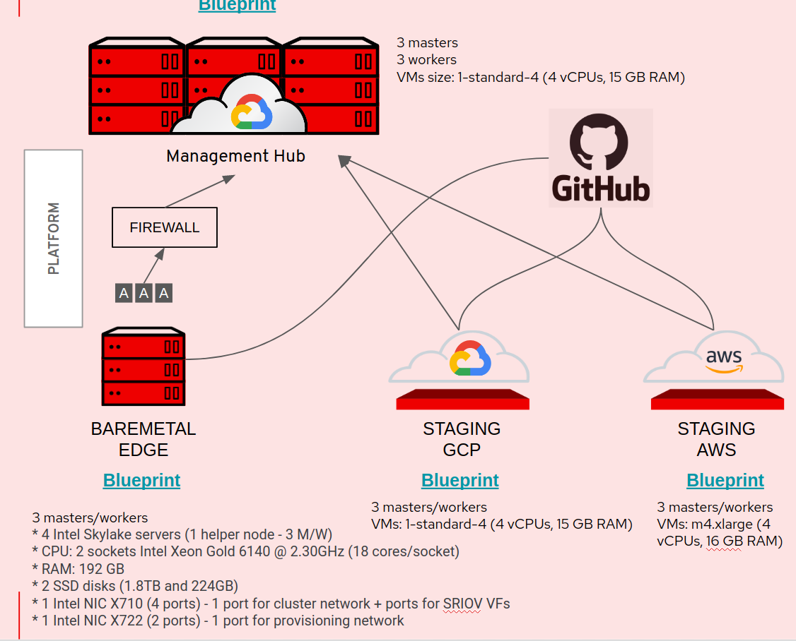

# Industrial Edge Computing MVP

This repository contains the required documentation in order to deploy the Industrial Edge Computing MVP. The MVP solution has been designed and built using Red Hat technologies and fulfils requirements from the manufacturing industry.

## Testbed

The architecture of the testbed is formed by four different clusters:

- 1 management hub
- 2 staging edge computing sites
- 1 baremetal edge computing site

The following picture shows a diagram of the testbed:

The management hub site is a 6 nodes OpenShift 4.5 cluster (3 masters and 3 workers) running the required components to allow CI/CD pipelines, managing edge computing sites and gathering data from them. This cluster is completely described by the [blueprint-management-hub](https://github.com/redhat-edge-computing/blueprint-management-hub). 

The 2 staging and the baremetal edge computing sites share the same number of nodes. These sites are full HA OpenShift 4.5 hyperconverged clusters composed by only 3 nodes that have both master and worker roles. This small footprint is suitable for running on edge locations such as manufacturing plants. The three sites are also descibed by the [blueprint-industrial-edge] (https://github.com/redhat-edge-computing/blueprint-industrial-edge). However the staging sites are running on public clouds (GCP and AWS) while the baremetal edge site works under the conditions of a real industrial factory (restricted network, behind firewall, local storage, etc...).

We have created a wrapper in order to deploy OpenShift clusters described by _blueprints_. Please, check out the following link: [https://github.com/redhat-edge-computing/kni-openshift-installer](https://github.com/redhat-edge-computing/kni-openshift-installer)

## Demo script

In order to test the whole solution, the following steps are required:

  1.- Deploy Management Hub: the definition of this site is located in the following [repo](https://github.com/redhat-edge-computing/blueprint-management-hub/tree/master/sites/edge-mgmt-hub.gcp.devcluster.openshift.com).
      Once the deployment has finished, a 6 nodes cluster will be running on GCP with a set of components:
      - Red Hat Advanced Cluster Manager
      - List of pre-provisioned cluster to be imported (3 remote edge computing sites)
      - OpenShift pipelines
      - ArgoCD Operator

  2.- Provision NFS server for *ReadWriteMany* volumes: TBD

  3.- Create `kubeconfighub.json` file with a base64 encoded version of the kubeconfig file from the recently deployed cluster (`base64 -w0 $HOME/.kni/edge-mgmt-hub.gcp.devcluster.openshift.com/final_manifests/auth/kubeconfig > $HOME/.kni/kubeconfighub.json`)

  4.- Deploy Edge Computing clusters: TBD
